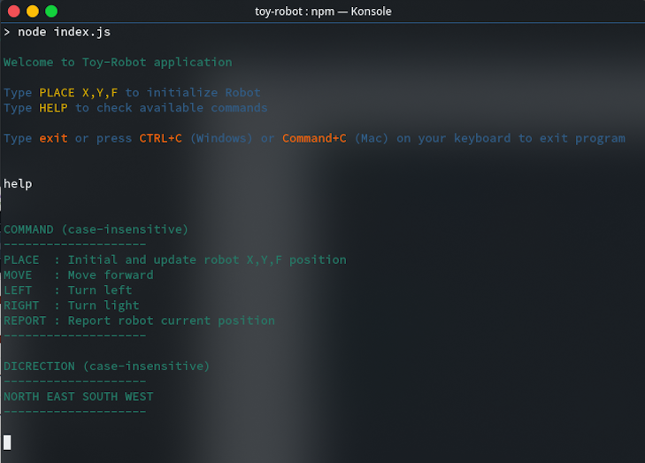

# Toy Robot Simulator

## Description

- Toy Robot Simulator is an interactive NodeJS CLI application
- You may refer to full problem description [here](PROBLEM.md)

## Prerequisite

To execute the app, we need:

* [Node.js](https://nodejs.org/en/download/)
* [npm](https://www.npmjs.com/)

## Dependencies

1. Install dependencies package by running `npm install`

## Test

This application is test using *[JEST](https://jestjs.io/)

1. Test the program by running `npm test`

## Running

To start the application from source

1. navigate to root directory and type `npm start`
2. Once application is running, type `help` to check available command
